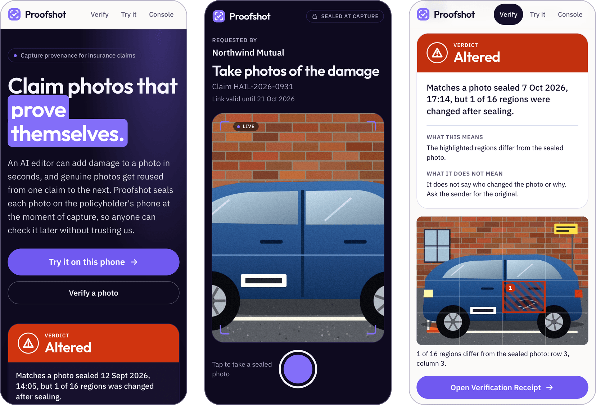
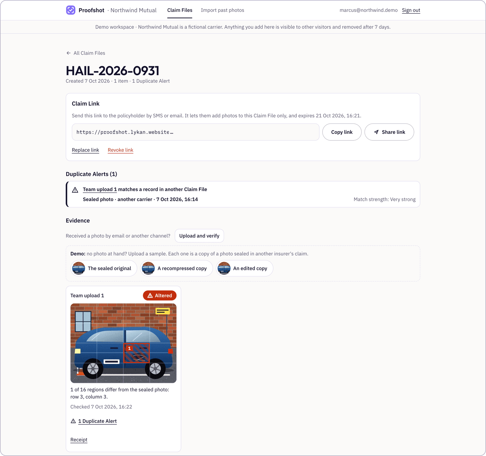
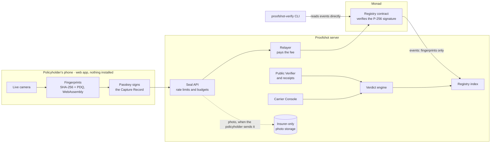
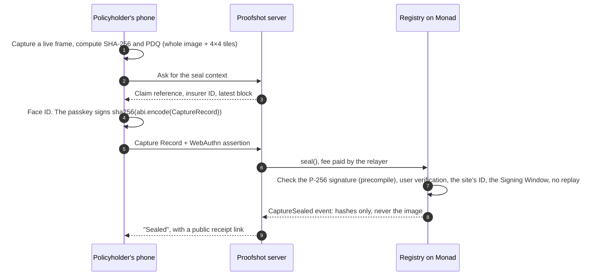
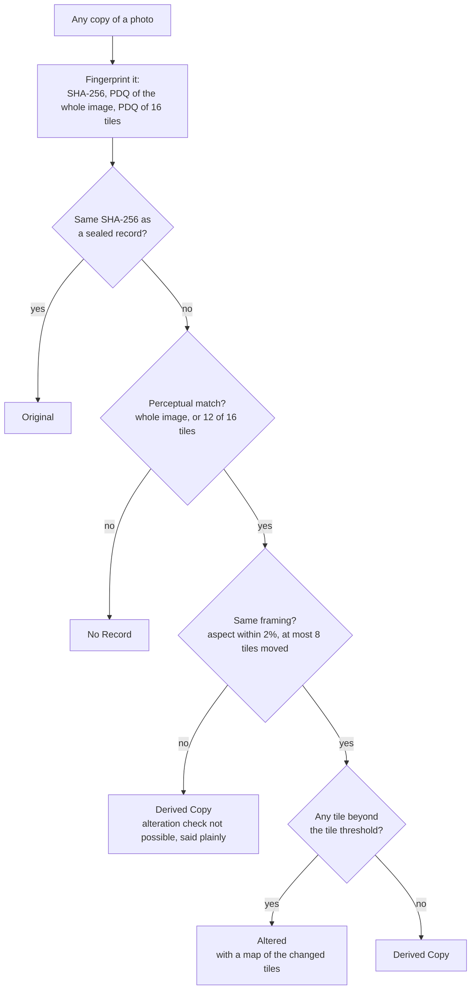

<div align="center">


# Proofshot

**Claim photos that prove themselves.**

Sealed on the phone with a passkey at the moment of capture, verified onchain on Monad,<br>
and checkable by anyone from any copy of the photo.

[](https://github.com/CemAyyildiz/proofshot/actions/workflows/ci.yml)
[](https://github.com/CemAyyildiz/proofshot/actions/workflows/monad-canary.yml)
[](https://proofshot.lykan.website)
[](LICENSE)

**[Live app](https://proofshot.lykan.website)** ·
**[Verify a sample photo](https://proofshot.lykan.website/verify)** ·
**[Insurer demo](https://proofshot.lykan.website/console/sign-in)** ·
**[Registry contract](https://monadvision.com/address/0xa6989c9f93d70526c1b982a5A408DF240575E433)**

<br>



</div>

## The problem

Insurance claims run on photos, and photos have stopped being evidence. An AI editor adds a dent or a water stain in
seconds, and genuine photos are reused from one claim to the next, at one insurer and across several. Provenance
metadata does not survive a messaging app.

Proofshot seals a photo where it is taken. The policyholder opens a link, with no app and no wallet. One Face ID
prompt signs the photo's fingerprints with a passkey that never leaves the phone, and a contract on Monad verifies
that signature before recording the Seal. From then on, anyone holding any copy of the photo, even one a messaging app
has recompressed, gets exactly one answer:

| Verdict | What it means |
|---|---|
| **Original** | Exactly the sealed file. Not a byte has changed. |
| **Derived Copy** | The same picture, re-saved. Nothing in it was changed. |
| **Altered** | Matches a sealed photo, but regions were changed. A map shows which ones. |
| **No Record** | Never sealed. That does not mean the image is fake. |

Insurers also learn when a photo was already used in another claim, including at another insurer, without either of
them sharing a photo.

Built for the Monad Metropolis hackathon, Track 04 (Trust, Identity & AI Infrastructure).

## Try it in two minutes

| | How | What you see |
|---|---|---|
| **Without a phone** | Open the [verifier](https://proofshot.lykan.website/verify) and pick a sample. The samples are copies of a photo sealed on Monad mainnet. | All four Verdicts, and the edit marked on the photo |
| **As an insurer** | Enter the [demo Console](https://proofshot.lykan.website/console/sign-in) with one tap and follow the three-step guide. | A Verdict on an uploaded photo and a Duplicate Alert across insurers |
| **On your phone** | Open the [live app](https://proofshot.lykan.website) and tap **Try it**. | Seal a photo of your own, then try to fool the verifier with an edited copy |

No sign-up and no wallet in any of the three.

<p align="center">
  
  
</p>

## How it works

### The system



### Sealing a photo



### From any copy to one Verdict



The Verdict engine is one function, [`computeVerdict`](packages/fingerprint/src/verdict.ts), shared by the website,
the Console and the command-line verifier. More detail: [docs/architecture.md](docs/architecture.md).

### What goes where

| Data | Where it lives | Who can see it |
|---|---|---|
| The photo | The phone, then the insurer's storage once it is sent | The policyholder and their insurer |
| Fingerprints of the photo | Registry events on Monad | Everyone, permanently. They can't be turned back into the image |
| Face ID, fingerprint, PIN | The phone | Nobody else. The Registry holds the passkey's public key |
| Which insurer, which claim | Onchain as a random ID and a hash | Meaningless to anyone but that insurer |
| A photo checked in the verifier | Fingerprinted and discarded | Nobody. The receipt keeps a hash and the result |

## What a Seal proves, and what it does not

A Seal proves that a specific device key signed these fingerprints, inside a short public time window, whether the
image changed since and where, and whether the same picture already exists elsewhere in the Registry.

It does **not** prove that the pixels came from the camera sensor: a virtual camera can feed the capture screen, and
a photo of a screen would still seal. Binding the phone's hardware attestation into the signed payload is the next
milestone. It also does not prove that the scene is what the sender says it is, or who the person is legally. The
[threat model](docs/threat-model.md) lists each threat with what is accepted today and what is planned.

## Why Monad

- **Passkeys verified onchain, cheaply.** Monad ships the P-256 signature precompile (EIP-7951), so the contract
  verifies a WebAuthn assertion over the whole Capture Record itself. No wallet, no extra key, no trusted signer.
- **Fast blocks.** The capture screen says "Sealed" only once the transaction's receipt is in. The sample photo on
  the live site was sealed four blocks, about 1.3 seconds, after it was signed.
- **Per-photo economics.** Every photo gets its own transaction, and every receipt points at it.
- **A shared, neutral registry.** Cross-insurer duplicate detection works on public fingerprints instead of a
  vendor-held pool of photos.

### Measured

| | Value | Source |
|---|---|---|
| `seal()` with the P-256 precompile | 100,340 gas | `pnpm --filter @proofshot/contracts gas:seal` |
| `seal()` without it | 326,571 gas | same command, Prague EVM |
| A live Seal, as a whole transaction | 126,823 gas, 0.013 MON | the [first Seal on mainnet](https://monadvision.com/tx/0x2f4dd8739a555fa874aba1e0890b3cb11cb3cf8d765770820d505745d04bb2b6) |
| Passkey verification alone, live on testnet and mainnet | 13,853 gas | [probe output](docs/monad-p256-probe.json), re-run every six hours in CI |
| Average block time, mainnet | 301 ms over 10,000 blocks | measured 2026-09-30 |
| Accuracy on generated scenes | Derived Copy and Altered recall 100%, no false Altered | [benchmark/README.synthetic.md](benchmark/README.synthetic.md) |

The Registry is deployed at
[`0xa6989c9f93d70526c1b982a5A408DF240575E433`](https://monadvision.com/address/0xa6989c9f93d70526c1b982a5A408DF240575E433)
on Monad mainnet, with its source verified. Deployment record:
[`contracts/deployments/143.json`](contracts/deployments/143.json).

## Reproduce a Verdict yourself

The Verdict engine is open source and the Registry is public. Given any image:

```bash
pnpm install
pnpm --filter proofshot-verify start ./photo.jpg \
  --rpc https://rpc2.monad.xyz \
  --registry 0xa6989c9f93d70526c1b982a5A408DF240575E433
```

The CLI fingerprints the file locally, reads `CaptureSealed`, `RecordImported` and `DeviceKeyRevoked` events straight
from the chain and applies the same `computeVerdict` as the website. An end-to-end test asserts that the two agree.
For a Seal it also prints the Signing Window, the device key and whether that key was later revoked. Add `--json` for
machine-readable output.

Try it on a sample: `apps/web/public/demo/edited-copy.jpg` comes back **Altered**, region 10, as it does on the
website.

The CLI reads the Registry's whole history, so the time depends on how many blocks the RPC serves per log query.
Monad's `rpc2.monad.xyz` serves 10,000 and took 32 seconds on 2026-10-10, three days after the Registry was deployed;
that grows by roughly ten seconds for every day of chain history. `rpc.monad.xyz` serves 100 blocks per query and
takes far longer.

## Run it locally

Requires Node 22, pnpm 10 and [Foundry](https://getfoundry.sh).

```bash
pnpm install
pnpm dev:chain     # terminal 1: local chain (Anvil) + Registry deploy; writes apps/web/.env.local
pnpm seed          # demo insurers: marcus@northwind.demo, dana@harbor.demo
pnpm dev           # terminal 2: http://localhost:3000
```

- **Carrier Console**: `/console/sign-in` → **Explore the demo Console**, or sign in as `marcus@northwind.demo`.
  Without an email provider the sign-in link is printed in the `pnpm dev` terminal and appended to
  `apps/web/.data/outbox.jsonl`.
- **Capture**: open a Claim Link in Chrome or Safari on the same computer. Passkeys and the camera work on
  `localhost`; phones need HTTPS.
- **Verify**: `/verify`.

Deploying your own instance: [docs/deploy.md](docs/deploy.md). Operating it: [docs/runbook.md](docs/runbook.md).

## Engineering

| Area | What is in place |
|---|---|
| **Contract** | 48 Foundry tests with 100% branch coverage of the Registry. Stateful invariants: no re-seal, sealing is permanent, no import of a sealed photo, exactly one admin, never admin and relayer at once. Slither on every push, a deep fuzz campaign on `main`. |
| **Application** | 197 unit and integration tests. Database tests run on an embedded Postgres and again on a real Postgres 17 server; a test fails when the schema changes without a migration. |
| **End to end** | 31 Playwright tests against the production build. Chrome's virtual authenticator and a fake camera produce real WebAuthn assertions that the Registry verifies on a local chain. |
| **Verdict rules** | A mutation test: every mutant of the Verdict rules must be killed. The command-line verifier and the website are asserted to agree. |
| **Accessibility** | Every surface is scanned with axe for WCAG 2.1 AA, in light and dark mode. |
| **Operations** | `/api/health` turns 503 on a low relayer balance, a paused Registry, an unreachable chain or a missing email provider. The relayer signs each transaction once, so a lost RPC response never produces a duplicate. |
| **Monad canary** | A scheduled workflow re-runs the passkey-verification probe against Monad testnet and mainnet every six hours and opens an issue when it fails. |

```bash
pnpm check              # typecheck, lint, unit and contract tests, build
E2E_PROD=1 pnpm e2e     # Playwright against the production build
pnpm --filter @proofshot/contracts coverage
pnpm --filter @proofshot/fingerprint mutate
```

## Security

Roles, trust assumptions and the test behind each contract guarantee are in [docs/security.md](docs/security.md).
In short: the admin is a cold key that can pause the Registry and rotate the relayer; the relayer is a hot key that
only pays fees and attests which insurer and claim a Seal belongs to; no account can hold both roles. To report a
vulnerability, see [SECURITY.md](SECURITY.md).

## Limits

- **Camera authenticity** is not proven yet, as described above.
- **Crops**: a copy cropped by more than a thin edge comes back **No Record**. A cropped copy is never shown as a
  clean result.
- **Accuracy** is measured on generated scenes only. It has not been run on a set of real phone photos yet.
- **Use so far**: the only Seals on mainnet are the builder's own and the demo samples. There is no latency
  percentile or outside usage to report.
- **Relayer trust**: in this version the relayer attests which insurer and claim a Seal belongs to. Signatures are not
  yet bound to the chain and Registry address, which is required before `seal()` is opened to anyone.
- **Sponsored fees**: Proofshot pays for every Seal. Rate limits, a daily budget per insurer and a gas-price ceiling
  bound the spend.

## Roadmap

1. Hardware attestation (iOS App Attest, Android Play Integrity) bound into the signed payload.
2. Connectors for claims-management systems, so a Claim Link is created where the claim already lives.
3. A consortium of insurers governing the Registry, with insurer-signed Claim Links and a permissionless `seal()`.

## Repository

| Path | What |
|---|---|
| [`apps/web`](apps/web) | Next.js app: capture, Public Verifier, receipts, Carrier Console, API routes, relayer, indexer |
| [`contracts`](contracts) | Registry (Solidity, Foundry), deploy script, local chain |
| [`packages/fingerprint`](packages/fingerprint) | SHA-256 and PDQ fingerprints and the Verdict engine, for the browser, the server and the CLI |
| [`packages/shared`](packages/shared) | Network config, typed environment, WebAuthn helpers, Capture Record encoding, Registry ABI |
| [`cli`](cli) | `proofshot-verify`: reproduce a Verdict from public data only |
| [`benchmark`](benchmark) | Accuracy benchmark |
| [`docs`](docs) | [Architecture](docs/architecture.md), [threat model](docs/threat-model.md), [security model](docs/security.md), [deploy](docs/deploy.md), [operations](docs/runbook.md) |

## License

[MIT](LICENSE). Vendored components keep their own licenses: PDQ
([`packages/fingerprint/vendor/pdq`](packages/fingerprint/vendor/pdq)) and the IBM Plex and Outfit fonts
([`apps/web/src/app/fonts`](apps/web/src/app/fonts)).
