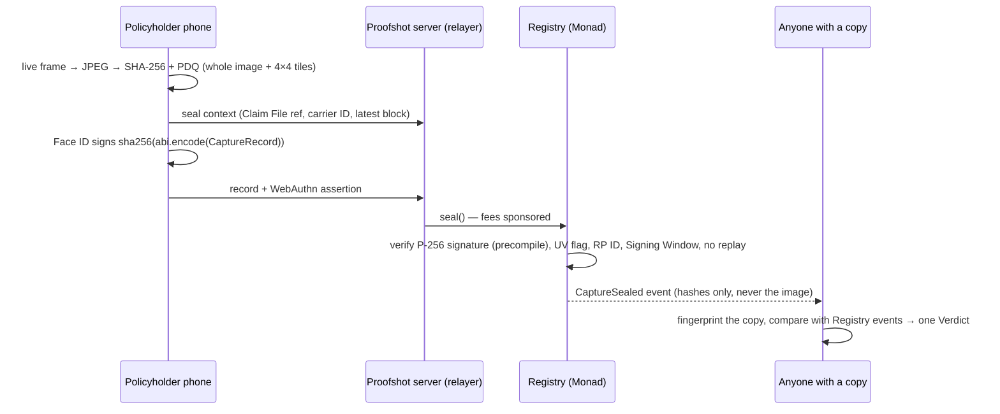

# Proofshot

**Claim photos that prove themselves.** A policyholder takes a claim photo inside Proofshot; one Face ID prompt signs
its fingerprints with a passkey that never leaves the phone, and a Monad contract verifies that signature onchain
before recording the Seal. From then on, anyone holding *any* copy of the photo — even one compressed by WhatsApp — can
check when it was sealed, whether it was altered and where, and whether it was already used in another claim,
without an account and without trusting Proofshot.

Built for the Monad Metropolis hackathon, Track 04 (Trust, Identity & AI Infrastructure).

**Judging? Start with the [5-minute judge's guide](docs/judges-guide.md).**

## What it does

| Who | What they get |
|---|---|
| **Policyholder** | Opens a Claim Link, no install, no wallet. One biometric prompt, then every photo is sealed as it is taken and sent only to their insurer. They keep public receipt links. |
| **Adjuster** (Carrier Console) | Every photo in a Claim File with its Verdict. Drops in an image that arrived by email and sees **Altered** with a map of the changed regions. |
| **Investigator** | A **Duplicate Alert** when a photo matches one sealed in another claim — at another insurer too — without either insurer sharing a single photo. |
| **Anyone** (Public Verifier) | Drops in any copy and gets exactly one Verdict: **Original**, **Derived Copy**, **Altered** (with a Tile Map) or **No Record**, plus a receipt they can re-check from public data. |

Try it: the landing page's **Try it** flow seals a photo from your own phone and walks you through trying to fool
the verifier.

## What a Seal proves — and what it does not

A Seal proves that a specific device key signed these fingerprints, within a public time window (the Signing Window),
whether the image changed since and where, and whether the same picture already exists elsewhere in the Registry.

It does **not** prove that the pixels came from the camera sensor (a virtual camera can feed the capture screen —
hardware attestation is the next milestone), that the scene is what the sender says it is, or who the person is
legally. See [docs/threat-model.md](docs/threat-model.md).

## Why Monad

- **Passkeys verified onchain, cheaply.** Monad ships the P-256 signature precompile (EIP-7951), so the contract
  verifies a WebAuthn assertion over the whole Capture Record for **100,340 gas per Seal** (vs 326,571 without the
  precompile) — measured with Foundry on the Osaka EVM. A keyless probe confirmed on **Monad testnet and mainnet**
  that the precompile is live and that the same OpenZeppelin verification accepts a passkey assertion (13,853 gas) and
  rejects a tampered one; live `seal()` gas and latency are pending a funded key ([docs/spikes/spike-b.md](docs/spikes/spike-b.md)).
- **Fast blocks and finality** are what make the "Sealed ✓ within 3 seconds" target (NFR-1) realistic; the live
  latency report is pending with the testnet run.
- **Per-photo economics**: at that gas, sealing every photo individually is affordable, so each Receipt points at
  its own transaction.
- **A shared, neutral registry**: cross-insurer duplicate detection works on public fingerprints instead of a
  vendor-held photo pool.

## How it works



More: [docs/architecture.md](docs/architecture.md).

## Reproduce a Verdict yourself

The Verdict engine is open source and the Registry is public. Given any image:

```bash
pnpm install
pnpm --filter proofshot-verify start ./photo.jpg --rpc <rpc-url> --registry <registry-address>
```

Relative paths resolve from the directory you run the command in. Add `--json` for machine-readable output.

The CLI fingerprints the file locally, reads `CaptureSealed` / `RecordImported` events straight from the chain and
applies the same `computeVerdict` the Public Verifier uses; an end-to-end test asserts they agree.

## Run it locally

Requires Node 22, pnpm 10 and [Foundry](https://getfoundry.sh).

```bash
pnpm install
pnpm dev:chain     # terminal 1: local chain (Anvil, Osaka EVM) + Registry deploy; writes apps/web/.env.local
pnpm seed          # demo carriers: marcus@northwind.demo, dana@harbor.demo
pnpm dev           # terminal 2: http://localhost:3000
```

- **Carrier Console**: `/console/sign-in` → **Explore the demo Console** (enabled locally by `pnpm dev:chain`), or sign
  in as `marcus@northwind.demo`: without an email provider the link is printed in the `pnpm dev` terminal (and appended
  to `apps/web/.data/outbox.jsonl`).
- **Capture**: open a Claim Link in Chrome or Safari on this computer (passkeys and the camera work on `localhost`).
  Phones need HTTPS — use the deployed app or a tunnel.
- **Verify**: `/verify`.

## Quality

```bash
pnpm check                         # typecheck, lint, unit + contract tests, build
pnpm e2e                           # Playwright: real passkey signatures sealed on a local chain
E2E_PROD=1 pnpm e2e                # same suite against the production build
pnpm screens                       # design screenshots of every surface → apps/web/test-results/screens
pnpm --filter @proofshot/contracts coverage
pnpm --filter @proofshot/benchmark bench   # SM-2 benchmark (needs benchmark/data)
```

End-to-end tests drive Chrome with a virtual platform authenticator and a fake camera, so every Seal carries a real
WebAuthn assertion that the Registry verifies onchain. Every product surface is scanned with axe for WCAG 2.1 AA in light and
dark mode. Registry branch coverage is 100%, with stateful invariants (no re-seal, sealing is permanent, no import of a
sealed photo, exactly one admin, and no account ever both admin and relayer) driven by Solidity-signed passkey
assertions interleaved with random role changes.

CI (`.github/workflows/ci.yml`) runs `pnpm check`, the Registry gas snapshot check and the e2e suite against the
production build on every push and pull request, plus a deep fuzz/invariant campaign on `main`. A separate **Monad canary**
(`monad-canary.yml`) re-runs the keyless passkey-verification probe against Monad testnet and mainnet every six hours.

## Status and honest limits

- **Accuracy benchmark**: the harness is done and passes every SM-2 target on generated scenes
  ([benchmark/README.synthetic.md](benchmark/README.synthetic.md)); the real-photo run is pending.
- **Crops**: the whole-image PDQ fingerprint recognises crops of about 2–3%. A copy cropped by 10% comes back
  **No Record**; a cropped copy is never shown as a clean result.
- **Indexing** runs inside the app (viem log reader into Postgres); the chain is the source of truth.
- **Relayer trust**: in v1 the relayer attests which carrier and claim a Seal belongs to; the admin (a separate cold
  key) can pause the Registry and rotate a compromised relayer.
- **Deployment**: runbook in [docs/deploy.md](docs/deploy.md).

## Repository

| Path | What |
|---|---|
| `apps/web` | Next.js app: capture PWA, Public Verifier, receipts, Carrier Console, API routes, relayer, indexer |
| `packages/fingerprint` | SHA-256 + PDQ (vendored WebAssembly) fingerprints and the Verdict engine — browser, server and CLI |
| `packages/shared` | Network config, typed env, WebAuthn helpers, CaptureRecord encoding, Registry ABI |
| `contracts` | Registry (Solidity, Foundry), deploy script, local dev chain |
| `cli` | `proofshot-verify`: reproduce a Verdict from public data only |
| `benchmark` | SM-2 accuracy benchmark |
| `docs` | Architecture, threat model, deploy runbook, requirement traceability, demo script, write-up draft, spikes, review log |
