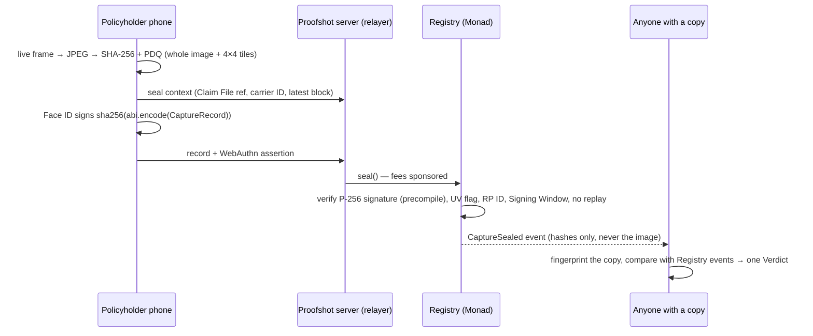

# Proofshot

**Claim photos that prove themselves.** A policyholder takes a claim photo inside Proofshot; one Face ID prompt signs
its fingerprints with a passkey that never leaves the phone, and a Monad contract verifies that signature onchain
before recording the Seal. From then on, anyone holding *any* copy of the photo — even one compressed by WhatsApp — can
check when it was sealed, whether it was altered and where, and whether it was already used in another claim,
without an account and without trusting Proofshot.

Built for the Monad Metropolis hackathon, Track 04 (Trust, Identity & AI Infrastructure).

- **Live on Monad mainnet:** https://proofshot.lykan.website — open **Try it** on a phone to seal a photo and then try
  to fool the verifier. No sign-up, no wallet.
- **Registry contract:** [`0xa6989c9f93d70526c1b982a5A408DF240575E433`](https://monadvision.com/address/0xa6989c9f93d70526c1b982a5A408DF240575E433),
  source verified. Deployment record: [`contracts/deployments/143.json`](contracts/deployments/143.json).

| Claim | Evidence |
|---|---|
| Monad verifies the passkey signature itself, onchain | A keyless probe on **testnet and mainnet**: the same OpenZeppelin `WebAuthn.verify` the Registry calls accepts a valid assertion (13,853 gas) and rejects a tampered one ([probe output](docs/monad-p256-probe.json), re-checked every six hours in CI) |
| The `seal()` call costs 100,340 gas; 326,571 without the P-256 precompile | `pnpm --filter @proofshot/contracts gas:seal` prints both (Osaka EVM, then Prague) |
| A live Seal is one 126,823 gas transaction, 0.013 MON | The [first Seal on mainnet](https://monadvision.com/tx/0x2f4dd8739a555fa874aba1e0890b3cb11cb3cf8d765770820d505745d04bb2b6) |
| Anyone can re-derive a Verdict without our servers | [Reproduce a Verdict yourself](#reproduce-a-verdict-yourself); an end-to-end test asserts the CLI and the website agree |

## What it does

| Who | What they get |
|---|---|
| **Policyholder** | Opens a Claim Link, no install, no wallet. One biometric prompt, then every photo is sealed as it is taken and sent only to their insurer. They keep public receipt links. |
| **Adjuster** (Carrier Console) | Every photo in a Claim File with its Verdict. Drops in an image that arrived by email and sees **Altered** with a map of the changed regions. |
| **Investigator** | A **Duplicate Alert** when a photo matches one sealed in another claim — at another insurer too — without either insurer sharing a single photo. |
| **Anyone** (Public Verifier) | Drops in any copy and gets exactly one Verdict: **Original**, **Derived Copy**, **Altered** (with a Tile Map) or **No Record**, plus a receipt they can re-check from public data. |

## What a Seal proves — and what it does not

A Seal proves that a specific device key signed these fingerprints, within a public time window (the Signing Window),
whether the image changed since and where, and whether the same picture already exists elsewhere in the Registry.

It does **not** prove that the pixels came from the camera sensor (a virtual camera can feed the capture screen —
hardware attestation is the next milestone), that the scene is what the sender says it is, or who the person is
legally. See [docs/threat-model.md](docs/threat-model.md), and [docs/security.md](docs/security.md) for roles, trust
assumptions and the test behind every contract guarantee.

## Why Monad

- **Passkeys verified onchain, cheaply.** Monad ships the P-256 signature precompile (EIP-7951), so the contract
  verifies a WebAuthn assertion over the whole Capture Record in a 100,340 gas call, against 326,571 without the
  precompile (Foundry, Osaka EVM).
- **Fast blocks.** The average block time measured over 10,000 blocks is 301 ms on mainnet (2026-09-30). The capture
  screen says "Sealed" only once the transaction's receipt is in.
- **Per-photo economics.** At 0.013 MON per Seal, every photo gets its own transaction, and each receipt points at
  it.
- **A shared, neutral registry.** Cross-insurer duplicate detection works on public fingerprints instead of a
  vendor-held photo pool.

## How it works



More: [docs/architecture.md](docs/architecture.md).

## Reproduce a Verdict yourself

The Verdict engine is open source and the Registry is public. Given any image:

```bash
pnpm install
pnpm --filter proofshot-verify start ./photo.jpg --rpc <rpc-url> --registry <registry-address>
```

Relative paths resolve from the directory you run the command in. Add `--json` for machine-readable output.

The CLI fingerprints the file locally, reads `CaptureSealed`, `RecordImported` and `DeviceKeyRevoked` events straight
from the chain and applies the same `computeVerdict` the Public Verifier uses; an end-to-end test asserts they agree.
For a Seal it also prints the Signing Window, the Device Key and, like the receipt, whether that key was later revoked.

## Run it locally

Requires Node 22, pnpm 10 and [Foundry](https://getfoundry.sh).

```bash
pnpm install
pnpm dev:chain     # terminal 1: local chain (Anvil, Osaka EVM) + Registry deploy; writes apps/web/.env.local
pnpm seed          # demo carriers: marcus@northwind.demo, dana@harbor.demo
pnpm dev           # terminal 2: http://localhost:3000
```

- **Carrier Console**: `/console/sign-in` → **Explore the demo Console** (enabled locally by `pnpm dev:chain`), or sign
  in as `marcus@northwind.demo`: without an email provider the link is printed in the `pnpm dev` terminal (and appended
  to `apps/web/.data/outbox.jsonl`).
- **Capture**: open a Claim Link in Chrome or Safari on this computer (passkeys and the camera work on `localhost`).
  Phones need HTTPS — use the deployed app or a tunnel.
- **Verify**: `/verify`.

## Quality

```bash
pnpm check                         # typecheck, lint, unit + contract tests, build
pnpm e2e                           # Playwright: real passkey signatures sealed on a local chain
E2E_PROD=1 pnpm e2e                # same suite against the production build
TEST_DATABASE_URL=postgres://… pnpm --filter web exec vitest run   # database tests on a real Postgres server
pnpm screens                       # design screenshots of every surface → apps/web/test-results/screens
pnpm --filter @proofshot/contracts coverage
pnpm --filter @proofshot/contracts slither   # static analysis (needs uv)
pnpm --filter @proofshot/fingerprint mutate  # mutation test of the Verdict rules: every mutant must be killed
pnpm --filter @proofshot/benchmark bench   # accuracy benchmark (needs benchmark/data)
```

End-to-end tests drive Chrome with a virtual platform authenticator and a fake camera, so every Seal carries a real
WebAuthn assertion that the Registry verifies onchain. Every product surface is scanned with axe for WCAG 2.1 AA in light and
dark mode. Registry branch coverage is 100%, with stateful invariants (no re-seal, sealing is permanent, no import of a
sealed photo, exactly one admin, and no account ever both admin and relayer) driven by Solidity-signed passkey
assertions interleaved with random role changes.

CI (`.github/workflows/ci.yml`) runs `pnpm check`, the Registry gas snapshot check, Slither static analysis and the
e2e suite against the production build on every push and pull request, plus a deep fuzz/invariant campaign on `main`.
Unit tests use an embedded Postgres (PGlite); a separate job runs the deploy-time migrate and seed scripts and every
database test again on a real Postgres 17 server through the production driver and connection pool, and a unit test
fails when `schema.ts` changes without a migration.
A separate **Monad canary**
(`monad-canary.yml`) re-runs the keyless passkey-verification probe against Monad testnet and mainnet every six hours,
and opens (or updates) a GitHub issue when it fails. A test also keeps the docs honest: every repository path the
README and `docs/` mention must exist.

## Limits

- **Accuracy** is measured on generated scenes only, where it meets every target
  ([benchmark/README.synthetic.md](benchmark/README.synthetic.md)). It has not been run on real phone photos yet.
- **Latency and use**: there is no latency percentile and no outside usage to report yet; the only Seals so far are
  the builder's own.
- **Crops**: the whole-image PDQ fingerprint recognises crops of about 2–3%. A copy cropped by 10% comes back
  **No Record**; a cropped copy is never shown as a clean result.
- **Indexing** runs inside the app (viem log reader into Postgres); the chain is the source of truth.
- **Relayer trust**: in v1 the relayer attests which carrier and claim a Seal belongs to; the admin (a separate cold
  key) can pause the Registry and rotate a compromised relayer. Signatures are not yet bound to the chain and
  Registry address — required before `seal()` is opened to anyone ([docs/security.md](docs/security.md)).
- **Sponsored fees**: Proofshot pays every Seal. Rate limits (per Claim Link, Device Key and visitor), a daily
  sponsored-write budget per carrier (small for the public demo carriers) and a gas-price ceiling bound the spend. Someone
  with many real IP addresses can still use up a demo carrier's daily budget, pausing that demo for everyone until the
  next day, but not the relayer's balance; the health check alarms on a low balance.
- **Hosting**: needs a long-running Node server behind a proxy — not serverless functions, whose 4.5 MB request cap
  rejects ordinary phone photos. Runbook and assumptions: [docs/deploy.md](docs/deploy.md),
  [docs/security.md](docs/security.md#deployment-assumptions).

## Repository

| Path | What |
|---|---|
| `apps/web` | Next.js app: capture PWA, Public Verifier, receipts, Carrier Console, API routes, relayer, indexer |
| `packages/fingerprint` | SHA-256 + PDQ (vendored WebAssembly) fingerprints and the Verdict engine — browser, server and CLI |
| `packages/shared` | Network config, typed env, WebAuthn helpers, CaptureRecord encoding, Registry ABI |
| `contracts` | Registry (Solidity, Foundry), deploy script, local dev chain |
| `cli` | `proofshot-verify`: reproduce a Verdict from public data only |
| `benchmark` | Accuracy benchmark |
| `docs` | [Architecture](docs/architecture.md), [threat model](docs/threat-model.md), [security model](docs/security.md), [deploy](docs/deploy.md) and [operations](docs/runbook.md) |
