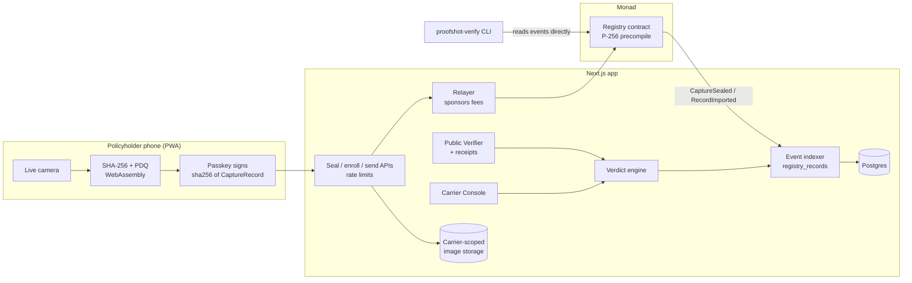

# Architecture

## Data that goes where

| Data | Where | Why |
|---|---|---|
| Image bytes | Carrier-scoped storage only (sent photos, Console uploads) | Evidence stays with the insurer (NFR-5) |
| Exact Hash, PDQ whole-image + 16 tile hashes, width/height | Registry events (public) | Anyone can re-check a copy |
| Location | A salted commitment only; coordinates and salt stay on the device, the salt also goes to the carrier | Disclosure is always explicit |
| Claim File | `claimRef = keccak256(claimFileId)` onchain; reference string only in the app DB | Opaque to the public |
| Carrier | A random 32-byte pseudonymous ID onchain | Duplicate Alerts say "another carrier", never which |
| Public Verifier uploads | Fingerprinted, never stored; only the outcome is kept for the receipt | FR-8 |

## Key flows

**Seal.** The phone fingerprints the JPEG, fetches `claimRef`, `carrierId` and the latest block from
`/seal-context`, and asks the passkey to sign `sha256(abi.encode(CaptureRecord))` with user verification. The server
checks the Claim Link, that the record names this Claim File and Carrier, rate limits (50 Seals per link, 200 per
Device Key per day, and the carrier's daily sponsored-write budget), then the relayer calls `Registry.seal()`. The
relayer signs each transaction once and knows its hash before broadcasting, so a lost RPC response never leads to a
second, duplicate transaction (`apps/web/src/server/chain/send.ts`). The contract checks the Device Key, the Signing Window
(≤ 100 blocks), the RP ID, UV, no replay, and the P-256 signature via the precompile. If the transaction lands but the
database write is lost, a retry or the send step adopts the onchain record (same Claim File and Device Key only).

**Verdict** (`packages/fingerprint/src/verdict.ts`). Exact Hash of a sealed record → Original. Otherwise the best
perceptual match (whole-image distance ≤ `T_match`, or ≥ 12 of 16 tiles within `T_tile`); none → No Record. Aspect
change > 2% or > 8 shifted tiles → Derived Copy with the Alteration Check unavailable. Any tile beyond `T_tile` →
Altered with those tiles. Imported records never yield Original.

**Duplicate Alerts.** After every Seal and Console upload, every Registry entry showing the same scene but belonging to
a different Claim File raises an alert labelled same/another carrier.

**Indexing.** The app reads Registry events in bounded `eth_getLogs` ranges into `registry_records` and keeps them in
memory; it resyncs at most once a second, and immediately after its own writes. An RPC outage yields an honest 503,
never a stale Verdict. On Monad networks every sync also re-reads the last 64 blocks. A log that a lagging RPC node
left out is picked up on a later pass. A record whose block hash changed (a reorg) is dropped. A record that is only
missing from one read, while its block is unchanged, is kept.

**Guard rails.** Uploads are refused above 20 MB and, from the image header alone, above 50 megapixels; at most two
images decode at once per process. Sign-in links are sent after the response, so timing never reveals whether an
account exists; the production session cookie is `__Host-` prefixed. `/api/health` returns 503 when the relayer's
balance is low, the Registry is paused, the chain is unreachable or no email provider is configured. Roles, trust
assumptions and the test behind each guarantee are in [security.md](security.md).
